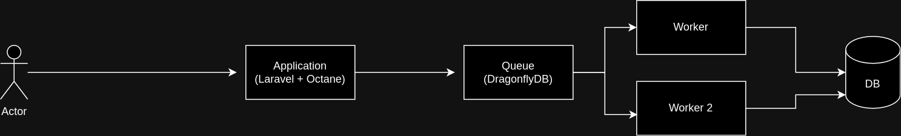

About
========

Technologies
===============

- PHP 8(opcache and jit enabled)
- Laravel
- Laravel Octane(using swoole)
- DragonflyDB(is like REDIS) for queue
- Docker 
- Docker-compose
- Cockroach(Database)

Architecture:
==============

Load test results:
===================

- Total requests: 1000 | Total concurrent users: 100 | All application running in docker
- 1º battery of tests:

┌─────────┬───────┬────────┬────────┬────────┬───────────┬──────────┬────────┐
│ Stat    │ 2.5%  │ 50%    │ 97.5%  │ 99%    │ Avg       │ Stdev    │ Max    │
├─────────┼───────┼────────┼────────┼────────┼───────────┼──────────┼────────┤
│ Latency │ 62 ms │ 205 ms │ 293 ms │ 303 ms │ 200.98 ms │ 49.79 ms │ 348 ms │
└─────────┴───────┴────────┴────────┴────────┴───────────┴──────────┴────────┘
┌───────────┬─────────┬─────────┬────────┬────────┬─────────┬─────────┬─────────┐
│ Stat      │ 1%      │ 2.5%    │ 50%    │ 97.5%  │ Avg     │ Stdev   │ Min     │
├───────────┼─────────┼─────────┼────────┼────────┼─────────┼─────────┼─────────┤
│ Req/Sec   │ 66      │ 66      │ 442    │ 492    │ 333.34  │ 190.14  │ 66      │
├───────────┼─────────┼─────────┼────────┼────────┼─────────┼─────────┼─────────┤
│ Bytes/Sec │ 19.1 kB │ 19.1 kB │ 128 kB │ 142 kB │ 96.3 kB │ 54.9 kB │ 19.1 kB │
└───────────┴─────────┴─────────┴────────┴────────┴─────────┴─────────┴─────────┘

- 2º battery of tests:

┌─────────┬───────┬────────┬────────┬────────┬───────────┬──────────┬────────┐
│ Stat    │ 2.5%  │ 50%    │ 97.5%  │ 99%    │ Avg       │ Stdev    │ Max    │
├─────────┼───────┼────────┼────────┼────────┼───────────┼──────────┼────────┤
│ Latency │ 60 ms │ 211 ms │ 272 ms │ 282 ms │ 205.47 ms │ 45.16 ms │ 299 ms │
└─────────┴───────┴────────┴────────┴────────┴───────────┴──────────┴────────┘
┌───────────┬───────┬───────┬────────┬────────┬─────────┬─────────┬───────┐
│ Stat      │ 1%    │ 2.5%  │ 50%    │ 97.5%  │ Avg     │ Stdev   │ Min   │
├───────────┼───────┼───────┼────────┼────────┼─────────┼─────────┼───────┤
│ Req/Sec   │ 83    │ 83    │ 441    │ 476    │ 333.34  │ 177.59  │ 83    │
├───────────┼───────┼───────┼────────┼────────┼─────────┼─────────┼───────┤
│ Bytes/Sec │ 24 kB │ 24 kB │ 127 kB │ 138 kB │ 96.3 kB │ 51.3 kB │ 24 kB │
└───────────┴───────┴───────┴────────┴────────┴─────────┴─────────┴───────┘

- 3º battery of tests:

┌─────────┬───────┬────────┬────────┬────────┬───────────┬──────────┬────────┐
│ Stat    │ 2.5%  │ 50%    │ 97.5%  │ 99%    │ Avg       │ Stdev    │ Max    │
├─────────┼───────┼────────┼────────┼────────┼───────────┼──────────┼────────┤
│ Latency │ 56 ms │ 206 ms │ 278 ms │ 412 ms │ 204.66 ms │ 57.87 ms │ 570 ms │
└─────────┴───────┴────────┴────────┴────────┴───────────┴──────────┴────────┘
┌───────────┬─────────┬─────────┬────────┬────────┬─────────┬─────────┬─────────┐
│ Stat      │ 1%      │ 2.5%    │ 50%    │ 97.5%  │ Avg     │ Stdev   │ Min     │
├───────────┼─────────┼─────────┼────────┼────────┼─────────┼─────────┼─────────┤
│ Req/Sec   │ 78      │ 78      │ 429    │ 493    │ 333.34  │ 182.43  │ 78      │
├───────────┼─────────┼─────────┼────────┼────────┼─────────┼─────────┼─────────┤
│ Bytes/Sec │ 22.5 kB │ 22.5 kB │ 124 kB │ 143 kB │ 96.4 kB │ 52.7 kB │ 22.5 kB │
└───────────┴─────────┴─────────┴────────┴────────┴─────────┴─────────┴─────────┘
