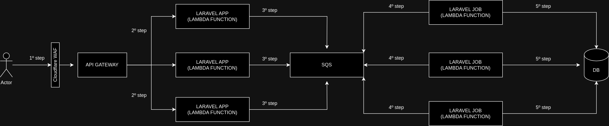

## About

The project is proof of concept where I tried to created feature where allow generate webhook url and accept request in this webhook url.

The main goal in this project is make the webhook url handle huge volume of requests using PHP + Laravel.

## Technologies

- PHP 8(opcache and jit enabled)
- Laravel
- Laravel Octane(using swoole)
- Lambda function(using bref.sh to allow me run laravel application as lambda function in AWS)
- Cockroach(Database)

Things I did to improve performance:
======================================

- Enabled PHP opcache 
- Enabled PHP jit
- Laravel octane + swoole to enable asynchronous programming for PHP, work as Node.js.
- Serverless architecture(FAAS) where scale your application based how many requests you received and scale the jobs based how many messages has in SQS queue.

Instructions to run project:
=============================

- Clone repository
- Create file **.env** file based **.env.exmaple** file. WARN: you need changes some envs like:
    ```
            APP_URL=endpoint_here // Copy endpoint generated after first deploy the application.
            DATABASE_URL='database_url_here'
            DB_CONNECTION=pgsql  
            QUEUE_CONNECTION=sqs
            

            AWS_ACCESS_KEY_ID=aws_access_key_id_here
            AWS_SECRET_ACCESS_KEY=aws_secret_access_key_here
            AWS_DEFAULT_REGION=us-east-1

            SQS_PREFIX=https://sqs.us-east-1.amazonaws.com/507403822990 // Copy the queue url value and remove queue name
            SQS_QUEUE=queue_name_here // You can put the value "default" here

    ```

- Execute command **composer install** to install dependencies
- Follow instructions in this link https://bref.sh/docs/setup 
- Follow instructions in this link  https://bref.sh/docs/laravel/getting-started to prepare your laravel application to run in Lambda function(AWS) 
- Execute command **sls deploy** will deploy the lambda application and jobs of queue in lambda function and access the address showed on terminal. 
    - The website will generate webhook url for you use.
        - Page make request for application each 10 seconds to get new requests associated webhook url.
    - After got webhook url send request for webhook url use GET, POST, PUT or DELETE http verbs.

## Architecture:



- 1º step: send request to webhook url generated, first pass throught Cloudflare WAF to check if exceeded the rate limit, case no, send request to Api gateway.
- 2º step: Api gateway trigger lambda function and pass data of request for The laravel lambda function. The important point is the AWS increment how many lambda functions based volume of requests received.
- 3º step: The Laravel lambda function received request and publish data on SQS queue where don't have restrictions about how many requests per second.
- 4º step: The AWS trigger the Laravel job lambda function for each message on SQS queue.
- 5º step: The Laravel job lambda function save registers on DB. WARN: your DB need to be prepared to receive a lot application doing insert instructions on database.

### Extra points about architecture

- You don't need to take care about scale your on application, because the AWS responsable to scale out and scale in the Laravel application.
- The Laravel job running inside the lambda function allow scale out and scale in the Laravel job based how many messages has on SQS queue, all managed by AWS.

Load test results(I used autocannon tool):
============================================

- 1º Load tests:

    - Total requests: 1000 | Total concurrent users: 100 

```
┌─────────┬────────┬────────┬─────────┬─────────┬───────────┬───────────┬─────────┐
│ Stat    │ 2.5%   │ 50%    │ 97.5%   │ 99%     │ Avg       │ Stdev     │ Max     │
├─────────┼────────┼────────┼─────────┼─────────┼───────────┼───────────┼─────────┤
│ Latency │ 164 ms │ 171 ms │ 2637 ms │ 2725 ms │ 408.49 ms │ 666.15 ms │ 3040 ms │
└─────────┴────────┴────────┴─────────┴─────────┴───────────┴───────────┴─────────┘
┌───────────┬─────────┬─────────┬─────────┬────────┬─────────┬─────────┬─────────┐
│ Stat      │ 1%      │ 2.5%    │ 50%     │ 97.5%  │ Avg     │ Stdev   │ Min     │
├───────────┼─────────┼─────────┼─────────┼────────┼─────────┼─────────┼─────────┤
│ Req/Sec   │ 32      │ 32      │ 103     │ 549    │ 200     │ 192.15  │ 32      │
├───────────┼─────────┼─────────┼─────────┼────────┼─────────┼─────────┼─────────┤
│ Bytes/Sec │ 9.48 kB │ 9.48 kB │ 30.5 kB │ 163 kB │ 59.2 kB │ 56.9 kB │ 9.47 kB │
└───────────┴─────────┴─────────┴─────────┴────────┴─────────┴─────────┴─────────┘
```

- 2º Load of tests:

  - Total requests: 2000 | Total concurrent users: 200 

```
┌─────────┬────────┬────────┬─────────┬─────────┬───────────┬──────────┬─────────┐
│ Stat    │ 2.5%   │ 50%    │ 97.5%   │ 99%     │ Avg       │ Stdev    │ Max     │
├─────────┼────────┼────────┼─────────┼─────────┼───────────┼──────────┼─────────┤
│ Latency │ 167 ms │ 189 ms │ 1694 ms │ 1922 ms │ 307.72 ms │ 373.7 ms │ 2015 ms │
└─────────┴────────┴────────┴─────────┴─────────┴───────────┴──────────┴─────────┘
┌───────────┬─────────┬─────────┬───────┬────────┬────────┬─────────┬─────────┐
│ Stat      │ 1%      │ 2.5%    │ 50%   │ 97.5%  │ Avg    │ Stdev   │ Min     │
├───────────┼─────────┼─────────┼───────┼────────┼────────┼─────────┼─────────┤
│ Req/Sec   │ 80      │ 80      │ 304   │ 827    │ 500    │ 318.31  │ 80      │
├───────────┼─────────┼─────────┼───────┼────────┼────────┼─────────┼─────────┤
│ Bytes/Sec │ 23.7 kB │ 23.7 kB │ 90 kB │ 245 kB │ 148 kB │ 94.2 kB │ 23.7 kB │
└───────────┴─────────┴─────────┴───────┴────────┴────────┴─────────┴─────────┘
```

- 3º Load of tests:

    - Total requests: 3000 | Total concurrent users: 300 

```

┌─────────┬────────┬────────┬─────────┬─────────┬───────────┬───────────┬─────────┐
│ Stat    │ 2.5%   │ 50%    │ 97.5%   │ 99%     │ Avg       │ Stdev     │ Max     │
├─────────┼────────┼────────┼─────────┼─────────┼───────────┼───────────┼─────────┤
│ Latency │ 165 ms │ 186 ms │ 1610 ms │ 2095 ms │ 286.46 ms │ 353.19 ms │ 2376 ms │
└─────────┴────────┴────────┴─────────┴─────────┴───────────┴───────────┴─────────┘
┌───────────┬─────────┬─────────┬─────────┬────────┬────────┬────────┬─────────┐
│ Stat      │ 1%      │ 2.5%    │ 50%     │ 97.5%  │ Avg    │ Stdev  │ Min     │
├───────────┼─────────┼─────────┼─────────┼────────┼────────┼────────┼─────────┤
│ Req/Sec   │ 318     │ 318     │ 324     │ 1202   │ 750    │ 429.32 │ 318     │
├───────────┼─────────┼─────────┼─────────┼────────┼────────┼────────┼─────────┤
│ Bytes/Sec │ 94.1 kB │ 94.1 kB │ 95.9 kB │ 356 kB │ 222 kB │ 127 kB │ 94.1 kB │
└───────────┴─────────┴─────────┴─────────┴────────┴────────┴────────┴─────────┘
```
